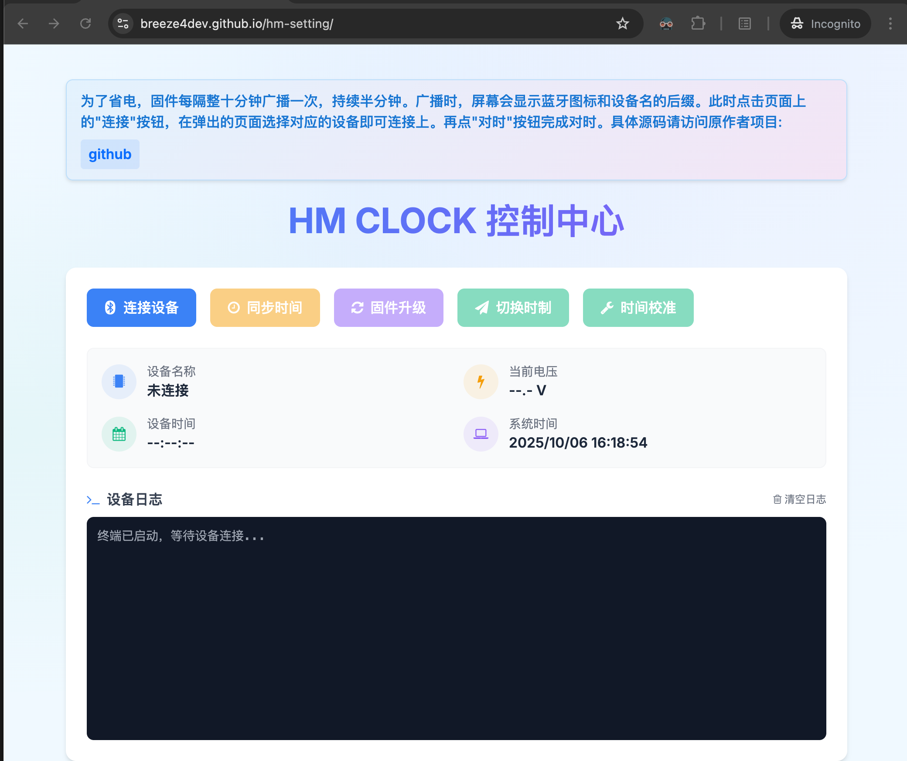
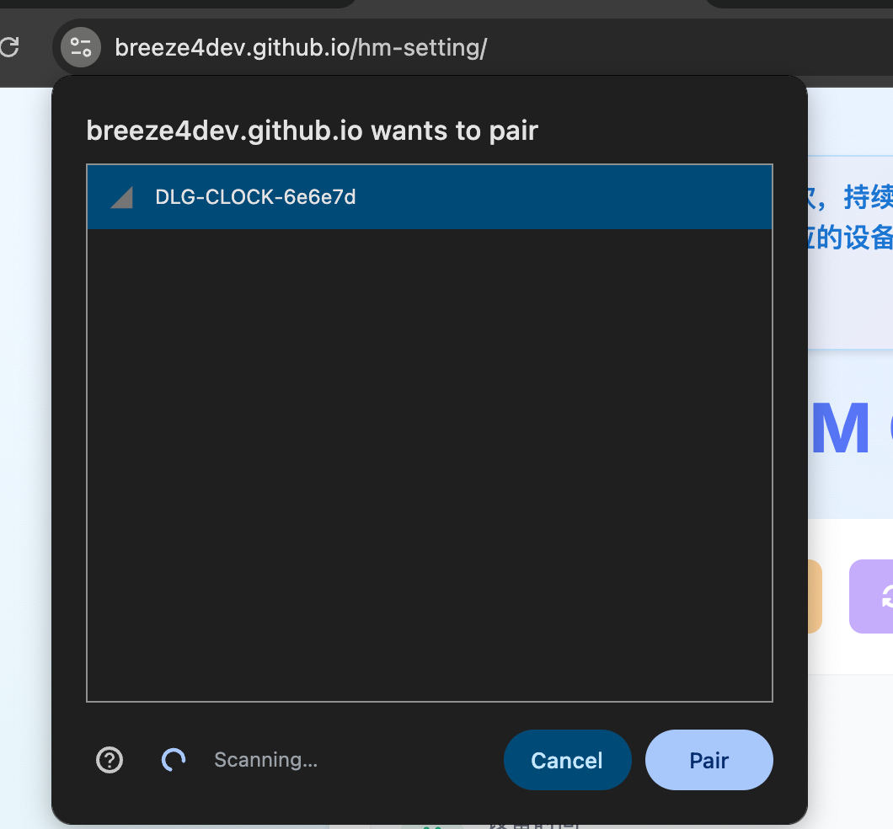

## 墨水屏日历设置

注意：为了省电，固件每隔整十分钟广播一次，持续半分钟。广播时，屏幕会显示蓝牙图标和设备名的后缀。此时点击页面上的"连接"按钮，在弹出的页面选择对应的设备即可连接上。再点"对时"按钮完成对时。具体源码请访问原作者项目:[Github](https://github.com/tpunix/HMCLOCK)

---

### 支持浏览器

- 电脑: Chrome/Edge
- Android: Chrome/Edge
- iOS: Bluefy 浏览器

### 使用方法

1. 使用使得的浏览器访问网址: <https://breeze4dev.github.io/hm-setting/>
2. 等待设备屏幕显示蓝牙图标和设备名时（或者将设备电源断开一下再连通以激活蓝牙广播），点击连接设备，选择DLG-CLOCK前缀开头的设备。
3. 点击同步时间，时钟会同步到当前时刻。
4. 点击切换时刻，时钟会切换12/24小时显示方式。

### 功能截图

